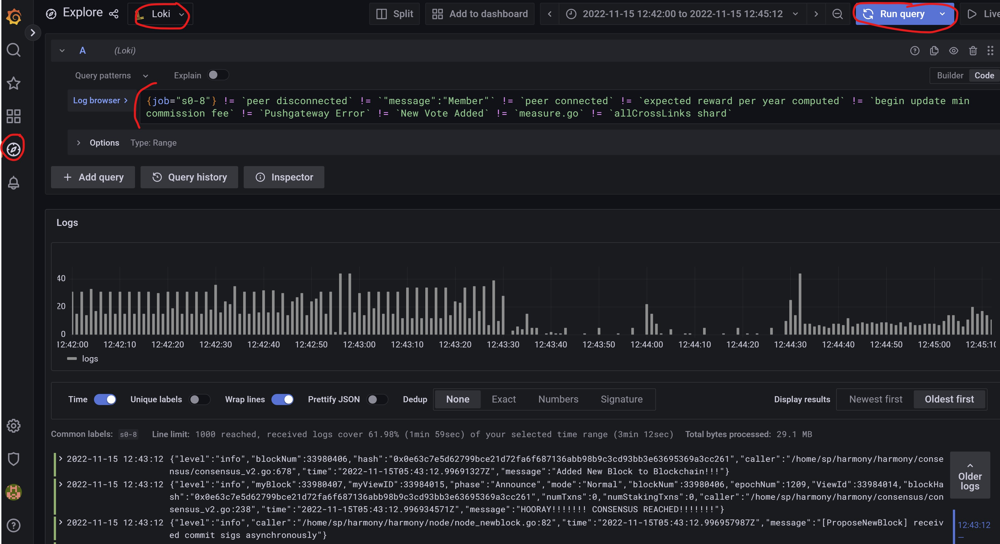

# Harmony node log viewer

## Prereq

- docker/docker-compose installed on your system
- logs you wanna import and analyse

## Promtail configuration

Promtail is the log reader in charge of sending the log to loki. It's necessary to configure the log stream in order to properly viewing it later in grafana

You'll need to copy the .log file into the currently configured stream ./data/old_logs/s0-<x> folder. Promtail will then match in its config ./config/promtail-config.yaml

## Run the stack

```bash
docker-compose up -d
```

## View the logs

- open your browser at 127.0.0.1:3000 
- grafana default password is admin/admin
- look for the compass (Explorer) and select on the top loki datasource
- Browse for a query or copy paste the below and run the query
```
{job="s0-0"} != `peer disconnected` != `"message":"Member"` != `peer connected` != `expected reward per year computed` != `begin update min commission fee` != `Pushgateway Error` != `New Vote Added` != `measure.go` != `allCrossLinks shard`
```



## FAQ

- if no logs are displayed
  - look at the timeframe and match the logs log
  - check loki and promtail logs for any error messages

