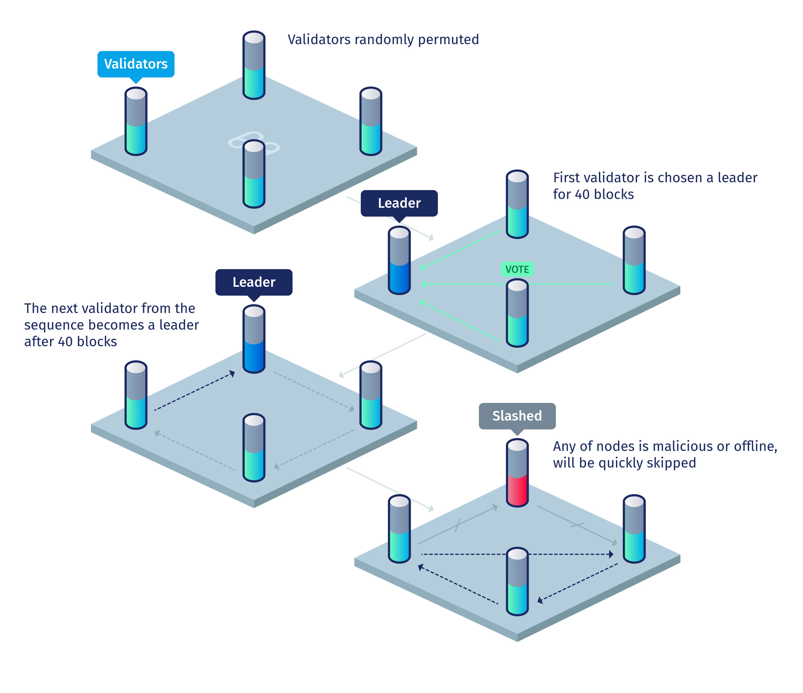

# Harmony Architecture

## Secure Sharding

Harmony adopts a Proof-Of-Stake (PoS) based sharding scheme that’s both secure and flexible. Harmony contains a beacon chain and multiple shard chains. The beacon chain serves as the random beacon and identity register, while the shard chains store separate blockchain states and process transactions concurrently. Harmony proposes an efficient algorithm for randomness generation by combining Verifiable Random Function (VRF) and Verifiable Delay Function (VDF). 

### Randomness

Sharding involves assigning nodes into different shards or branches. Nodes within the same shard form a committee and run consensus in parallel. Various approaches have been proposed to assign nodes into shards such as randomness-based sharding in [Omniledger](https://eprint.iacr.org/2017/406.pdf) and [RapidChain](https://eprint.iacr.org/2018/460.pdf), location-based sharding, and centrally-controlled sharding. Out of all the approaches, randomness-based sharding is recognized as the most secure solution. In randomness-based sharding, a mutually agreed random number is used to determine the sharding assignment for each node. The random number must have the following properties:

**Unpredictable:** No one should be able to predict the random number before it’s generated.

**Unbiasable:** The process of generating the random number should not be bias-able by the participants.

**Verifiable:** The validity of the generated random number should be verifiable.

**Scalable:** The algorithm of randomness generation should scale to large number of participants.

Randomness is among the most important component for a secure sharded network of nodes. We have studied and analyzed the complexity and security features of various Randomness algorithms and functions such as Randhound Protocol, Verifiable Secret Sharing(VSS), Verifiable Random Function (VRF) among others. The Ethereum 2.0 design proposed the use of VDF (Verifiable Delay Function) to delay the revelation of the actual random number so as to prevent last-revealer attack. VDF is a recently studied cryptographic primitive which takes an adjustable minimum amount of time to compute and the result can be verified immediately.

**Harmony’s** approach borrows elements from the above works, but differs from them in the following ways. First, Harmony’s Distributed Randomness Generation (DRG) protocol is _O(N)_ complex, which is at least an order of magnitude faster than RandHound. Second, unlike the VSS-based approach, ours is unbiasable and verifiable. Third, compared to Ethereum 2.0’s solution, our approach uses BFT consensus to provide finality to the random number. Besides, the DRG protocol runs naturally with the shard committee of a leader and many validators. 

Specifically, the protocol contains the following steps:

1. A leader sends an init message with the hash of the last block H(Bn-1) to all the validators to start the DRG protocol.
2. For each validator i, after receiving the init message, a VRF is computed to create a random number ri and a proof pi:  (ri, pi)=VRF(ski, H(Bn-1), v) , where ski is the secret key of validator i and v is the current view number of consensus. Then, each validator sends back (ri, pi) to the leader.
3. The leader waits until it receives f+1 valid random numbers and combine them with XOR operation to get the random number preimage pRnd.
4. The leader runs BFT among all the validators to reach consensus on the pRnd and commit it in block Bn.
5. After pRnd is committed, the leader starts computing the actual randomness Rnd=VDF(pRnd, T), where T is the VDF difficulty and is set algorithmically such that the randomness can only be computed after k blocks.
6. Once Rnd is computed, the leader initiates a BFT among all validators to agree on the validity of Rnd and finally commit the randomness into the blockchain.

The use of VDF here is to provably delay the revelation of Rnd and avoid malicious leader biasing the randomness by specifically selecting a subset of the VRF random numbers. With VDF, the leader won’t be able to know what’s the actual randomness before the pRnd is committed into the blockchain. Therefore, the best a malicious leader can do is either blindly commiting the randomness pRnd, or stalling the protocol by not committing the pRnd. The former is the same as the honest behavior. The latter won’t cause much damage as the same timeout mechanism in PBFT will be used to switch the leader and restart the protocol.

### Beacon Chain

Our beacon chain is a special blockchain that serves additional purpose compared to the shard chains. In effect, the beacon chain is also a shard. Besides processing transactions like other shard chains, the beacon chain is in charge of two additional key functionalities: **generating the random number** and **accepting stakes**. The beacon chain is the place where stakers deposit their tokens to become validators. The validators for the beacon chain are determined the same way as for other shards. 

### Account Model

Unlike other blockchains, with state sharding, that have adopted a UTXO-based data model, Harmony’s state sharding adopts an account-based data model. Each shard chain contains its own account state which is independent and consistent with other shards’ states. 

Specifically, we treat user accounts and smart contract accounts differently in sharding. A user account can have multiple balances across different shards (e.g. 100 tokens in shard A and 50 tokens in shard B). A user account can move its balance between shards by issuing a cross-shard transaction to its own address to the other shard. 

Smart contracts accounts are limited to the specific shard where the contract was created. However, for a Decentralized application that requires more throughput than what a single shard can handle, the application developer can instantiate multiple instances of the same smart contract across different shards and let each instance handle a subset of the incoming traffic. Though the different instances of the same smart contract don’t share the same state, they can talk to each other via cross-shard communication.

## Consensus

Harmony’s consensus protocol is a variant of **PBFT** (Practical Byzantine Fault Tolerance) . Traditional PBFT has _O(N2)_ communication complexity due to rebroadcasting of votes among validators, which is not scalable for a blockchain with hundreds or thousands of nodes. Harmony’s consensus reduces the communication complexity from _O(N2)_ to _O(N)_ using BLS (Boneh-Lynn-Shacham) multi-signature. BLS is a pairing-based cryptographic signature scheme that supports multi-party signing with constant-sized signature. 

Specifically, the consensus protocol involves following steps:

1. The leader constructs the new block and broadcasts the block header to all validators. Meanwhile, the leader broadcasts the content of the block with erasure coding (Harmony adopts [RaptorQ fountain code](https://en.wikipedia.org/wiki/Raptor_code) to speed up the block broadcasting process).
2. The validators check the validity of the block header, sign the block header with a BLS signature, and send the signature back to the leader.
3. The leader waits for at least 2f+1 valid signatures from validators and aggregates them into a BLS multi-signature. Then the leader broadcasts the aggregated multi-signature along with a bitmap indicating which validators have signed.
4. The validators check that the multi-signature has at least 2f+1 signers, verify the transactions in the block content broadcasted from the leader in Step 1, sign the received message from Step 3, and send it back to the leader.
5. The leader waits for at least 2f+1 valid signatures from Step 4, aggregates them together into a BLS multi-signature, and creates a bitmap logging all the signers. Finally, the leader commits the new block with all the multi-signatures and bitmaps attached, and broadcasts the new block to all validators.

## Networking 

Research has pointed out that network capacity is one of the major bottlenecks for blockchain systems. In order to increase performance, Harmony focuses on improving the efficiency of network utilization.

**Kademlia-based Node Discovery and Routing**
In traditional public client-server networking, the servers are typically located using a centralized registration/discovery mechanism such as DNS. Private, cooperative clusters also use dedicated components such as ZooKeeper, Consul, etc. to discovery nodes. However, these approaches require setup and operation of a centralized discovery mechanism, which becomes a single point of failure and, when used publicly, quickly becomes a target of denial-of-service attacks.

We use a [Kademlia DHT](https://pdos.csail.mit.edu/~petar/papers/maymounkov-kademlia-lncs.pdf) to let a node discover other nodes that it needs to talk to, given their identity (a private-public key pair). Once a node discovers where another node resides (IP address), a direct communication is used between them.

Inspired by RapidChain, we adopt Kademlia as the routing mechanism for cross-shard messages. With Kademlia-based routing, messages only travel across _O(logN)_ nodes before it reaches the destination. Compared to normal gossip broadcasting, which requires a _O(N)_ network complexity, the Kademlia routing mechanism can significantly reduce the overall network load in a sharded blockchain.

**Adaptive, Adversary-resilient Multicasting With Fountain Code**

Broadcast is a frequent network action in any blockchain system built on P2P network overlay.  On shared blockchain, multicast— a limited-subset broadcast — is also important.  Specifically in our consensus protocol, a few scenarios need broadcast and/or multicast:

1. A newly proposed block needs to be multicast by the leader to all validators in the same shard.

2. A newly generated master chain block needs to be broadcast to the whole network.

3. Cross-shard transactions need shard-to-shard multicast.

P2P networks often implement broadcast using flooding, which incur _O(dm)_ send/receive load on each node on the network, where _d_ is the average number of neighbors of a node and _m_ is the message size.  RapidChain enhanced this load in its IDA (Information Dispersal Algorithm) which uses a fixed-rate erasure code to battle non-functioning/uncooperative/malicious nodes in the network, while each node bears only _O(zm)_ send/receive load where _z_ is the all-peers-to-honest-peers ratio (a constant ≥ 1.0, set by the shard size _m_, the peer fanout _d_, the network size _n_, and the maximum non-honest node count _k_), and is typically much lower than _d_.

Harmony proposes an adaptively adversary-resilient version of multicast using RaptorQ—a _rateless_ erasure code, also known as a “fountain code”—where the send/receive load on each node is _O(qm)_, where _q_ is not pessimistically determined as in flooding or RapidChain IDA but is constantly adjusted to account for the current state of the network.  This adaptiveness not only lets the performance achieve near optimality—in optimal situations with low packet losses and mostly honest network members, _q_ can approach 1.0—but also lets performance degrade smoothly and predictably, in proportion with the degree of current network failure, well beyond the point where most traditional approaches fail or exhibit severely degraded performance.

