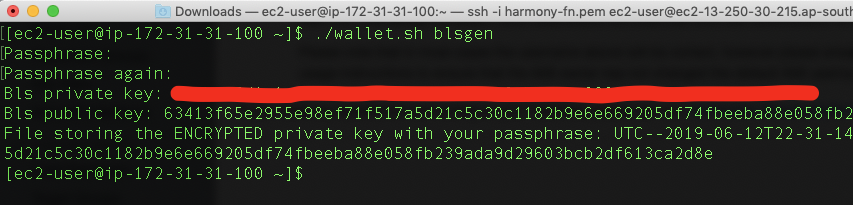
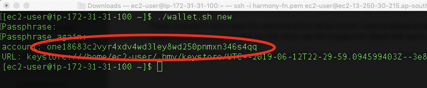
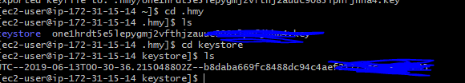

# Harmony Foundational Node Key Management Guide
  
**Welcome node operators!**
  
We welcome you to keep earning block rewards with us, therefore here are some safety guidance and tips to keep your node credentials safe and secure. Please don’t turn off your instance unless you have a copy of it secure in your local machine!
  
1. Remember that BLS private–public key pair you made? That is one of the most important things to keep safe when you are running your nodes! The BLS private key allows you to move to a different instance and region if you ever want to! Please keep it safe in a different place on top of your computer. Make sure you backup your keys where you can access keys easily!
	- Please back up your your BLS private key. The screenshot below shows the format of both the BLS public key and BLS private key.
	
  
2. You also generated your Harmony wallet (account) ID along with a matching private key.  You will need this private key later when you claim your earnings,  so please keep it safe as you would with a real life wallet!
	- Your wallet ID starts with: one1
	
	- The matching private key is stored in the .hmy subdirectory where you run your node. [.hmy/keystore folder is hidden on many computers, open the terminal ….]
	
  
3. Now that you have saved and kept your very important keys (BLS  and wallet private keys) let's move onto some more safety tips!
	- Never share your BLS or wallet private key with someone! Not even Harmony members will ask for it. If anyone asks you for it. Please do not give it to them.
  
4. To move your 2 files out of your instance. Please follow below:
	- In your terminal: cd where you would like to place the files into. For example: cd downloads/ will put the files in to the downloads folder. Below is a brief overview for more detailed instructions please click this link.
	```
	scp -i <pem> <from> <to>
	scp -i ec2key.pem username@ec2ip:/path/to/file
	```

	Here is an example showing you how to download a wallet private key:
	```
	scp -i oregon-key-benchmark.pem
	ec2-user@54.190.19.255:/home/ec2-user/UT* ./keybackup/
	```

	Where:  
		- ec2key.pem is your PEM key
		```
		ec2key.pem
		```
		- username is the username you log in with
		```
		username
		```
		- ec2ip is the IP or DNS alias of the instance
		```
		@ec2ip
		```
		- Anything after ":" is the source of the file you want to copy
		```
		:/home/ec2-user/
		```
		- while anything after "." is the destination for your copied file
		```
		./keybackup/
		```
		This will copy the file into the current folder on the local machine
  
 5. Another way we can copy your files from the instance to the local machine is by downloading Filezilla or WinSCP, these programs will allow you to drag and drop files to your local computer!

 6. Once you copy over, please double check your folder in your local machine to make sure you have the keys! Now you have your keys in your instance and local machine! [how can they check]

