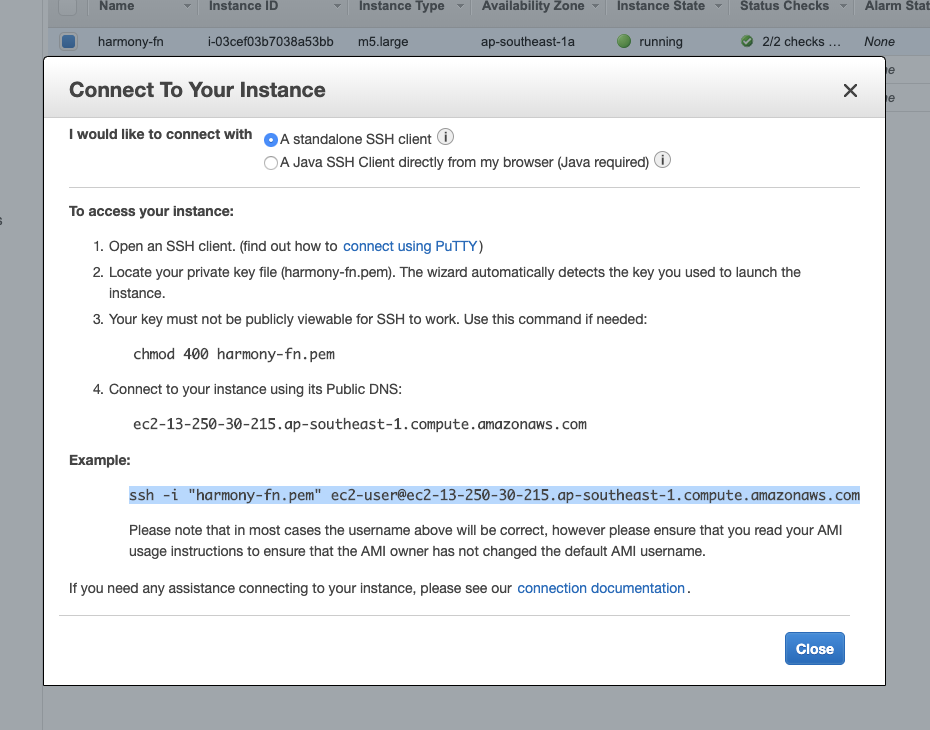
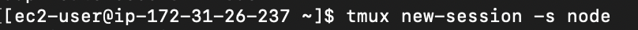
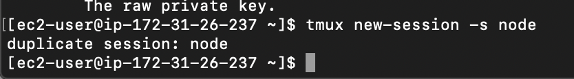
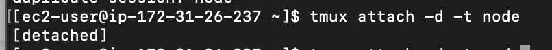

# Node Operator Mainnet Launch
  
At the time of Harmony Mainnet launch (Friday June 28th at 8:00am PDT), you will have to restart your node. Before you go through this make sure to follow up with our key management guide in order to prevent any mistakes or key loss.
  
Here are the following commands you should use to relaunch:
  
**Step 1:** Open terminal/command prompt.
  
**Step 2:** Connect to your instance, using ssh (check your aws ec2 instance for exact command.


  
**Step 3:** Download the latest version of the wallet script in your terminal (you can run all 4 commands together using " && " in between each).
```
curl -LO https://harmony.one/wallet.sh
chmod a+x wallet.sh
./wallet.sh -d
./wallet.sh list
```
  
**Step 4:** Enter "**tmux new-session -s node**" to make a new tmux session named "node".
  


**Step 5:** If you have tmux up and runnning already, you will recieve the "**duplicate session**" error. To avoid this use "**tmux attach**" as shown below:
  


  
**Step 6:** Copy and paste the following commands one at a time:
```
curl -LO https://harmony.one/node.sh
chmod a+x node.sh
sudo ./node.sh -c
```
  
**Step 7:** Press ctrl+b then hit "d" to detach from tmux
  
**Step 8:** Check your wallet balances using
```
./wallet.sh balances
```
