# Harmony Foundational Node Setup Guide

**Welcome and thank you for participating in the genesis of Harmony’s network!**

This is a guide for setting up your Foundational Node to participate in Harmony Mainnet v0 up until mainnet v1. By participating as a foundational node operator, you will claim block rewards that will convert into real ONE tokens upon launch of mainnet v1.

Please keep in mind that the network is likely to be unstable and we may experience halts or other forms of failure requiring intervention. This is expected while the network gains stability. We really appreciate your patience during this time.

The primary goal of Mainnet v0 is to demonstrate a production-level stable network that tests our consensus anChange the “Size (GiB)” category to 30d sharding. Soon after achieving stability, we will test out our PoS through a Game of Stakes type competition. This will help us test various attack vectors and various economic and technical parameters in our PoS implementation.

**Community Channels**

Most coordination will happen via our foundational node Discord channel. Please join so that you can stay up to date. Our team will be available to help walk you through the process should you run into any issues following this guide.

1. Discord - https://harmony.one/discord  
		a. Once you have joined our discord channel, send a message to “@Li | Harmony.one#7220” to add you to the private “foundational-node” channel. 

2. Telegram - https://t.me/joinchat/HZniehM2XxaokN1QbglsaQ  
		a. If you prefer Telegram join our foundational node channel at the link above.  

3. WeChat -  
		a. If you prefer WeChat, scan this QR code. If the code has expired, notify Li (li@harmony.one)  
		

**Setting up your node on AWS**

This will walk you through the steps to launch your cloud instance on AWS. Then it will take you through the process of downloading and installing the Harmony node software and generating an address for you to participate in the network. You can watch a video walk through of the first two steps at https://harmony.one/fn-video and https://youtu.be/AWnkXGGwhIo.

**Launching your AWS instance**

1. If you don’t already have an AWS account, register one at https://aws.amazon.com.

2. Log into your AWS account

3. Click on the top left bar “Services -> Compute -> EC2”
  


4. Click on the blue button “Launch Instance”

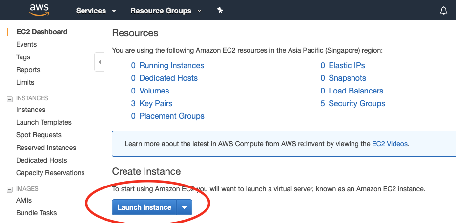

5. Select “Amazon Linux 2 AMI (HVM), SSD Volume Type”

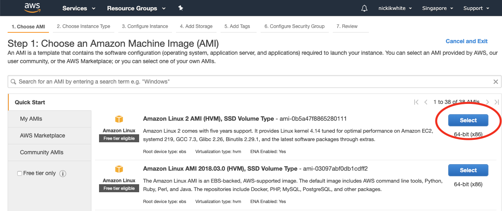

6. Choose instance type “m5.large” (you will have to scroll down to see it)

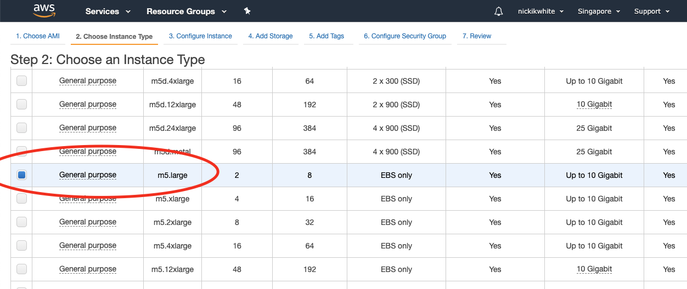

7. Click “Next: Configure Instance Details” at the bottom right of the page

8. Nothing to change here, so click “Next: Add Storage”

9. Change the “Size (GiB)” category to 30

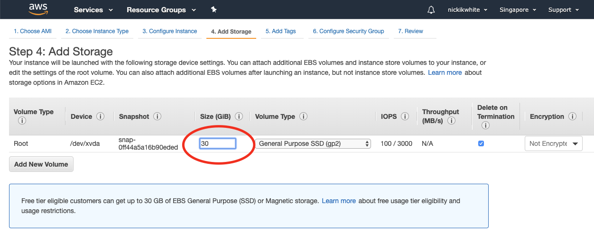

10. Click “Next: Add Tags

11. In the “Key” input box put “Name” in “Value” put “harmony-fn”

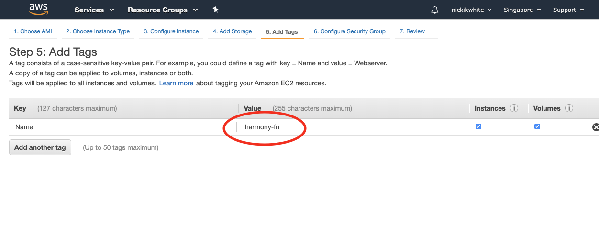

12. Click “Next: Configure Security Group”

13. On the default SSH with port 22, change the “Source” option to “Anywhere”

14. Now you will need to add the following 4 ports: 6000, 9000, 14555 and 9999. To add each of them, click “Add Rule”, under type select “Custom TCP Rule”, under “Port Range” put the port number, for “Source” select “Anywhere”. Repeat the process until you’ve added all the ports.

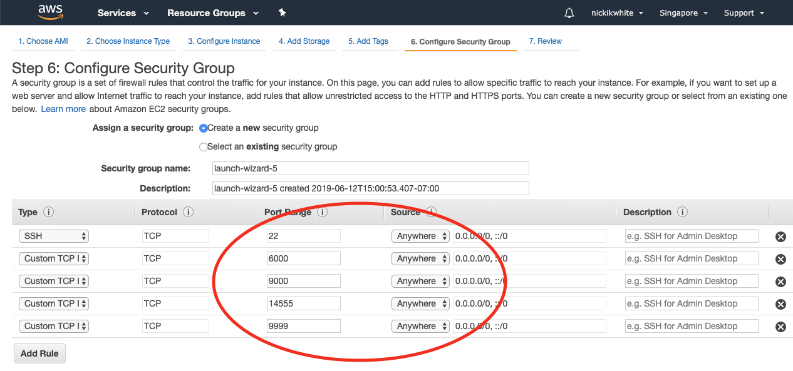

15. Click “Review and Launch”

16. Ignore warnings such as “your security group is open to the world” or “your instance configuration is not eligible for free tier”

17. Click “Launch”, See Troubleshooting below if you are getting an error.

18. In the pop-up window you will need to create a new key pair. Select “Create a new key pair” and then enter a name that you like, for example “harmony-fn”

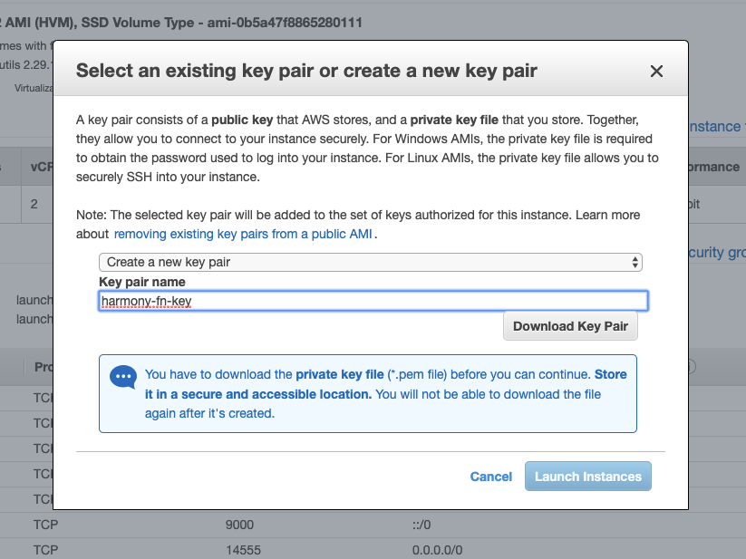

19. Click “Download Key Pair”

20. Click “Launch Instances”

21. Click “View Instances”. Your new instance should be initializing. Wait a few moments for it to get started.

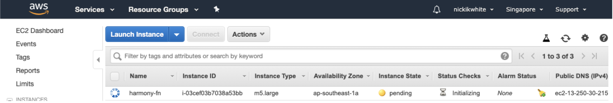

22. Keep this window open for future reference

**Connecting to your AWS instance and generating your keys**

1. Open a Terminal window on your computer. If you can’t find Terminal, search for it in your applications folder. If you are on a mac, they often hide Terminal inside of the “Utilities” folder within Applications.
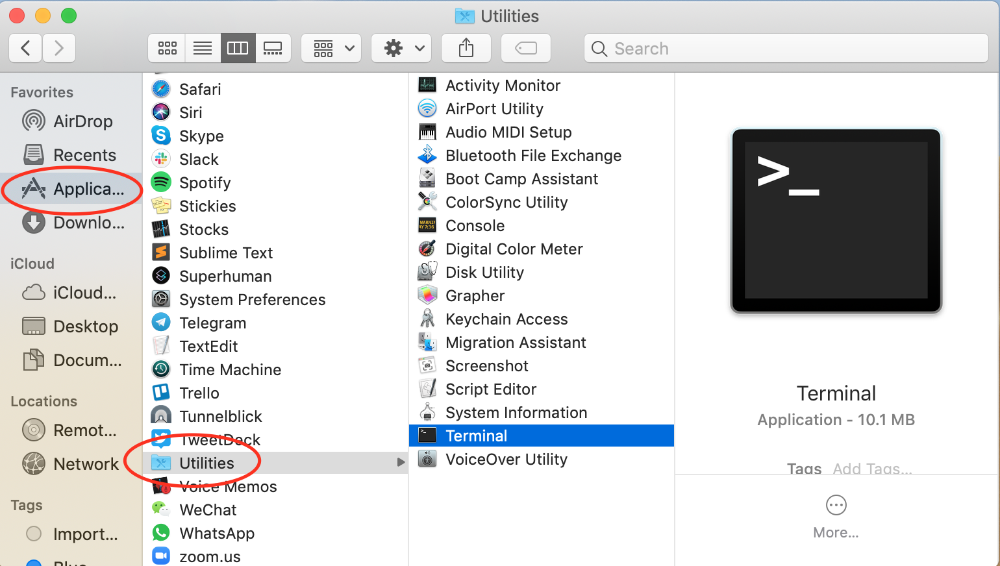
	
	If you are on windows, download Putty or Git Bash to allow your computer to SSH into the AWS instance. For instructions on connecting to an EC2 instance using Putty follow the following resource from Amazon : https://docs.aws.amazon.com/quickstarts/latest/vmlaunch/step-2-connect-to-instance.html

2. Once Terminal is open, use the “cd” command to change your directory to where the key pair file (harmony-fn.pem) that you generated is. Hint it may be in your “Downloads” folder.

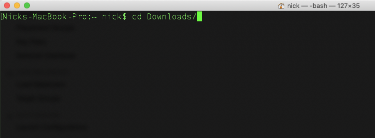

3. Enter the command “chmod 400 harmony-fn.pem” (this makes your key not publicly viewable).

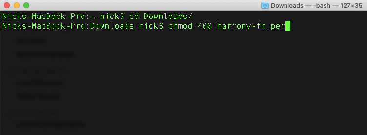

4. Go back to your AWS window where you are viewing your instances, select your new instance (it should be named “harmony-fn”) and click “Connect” on the top bar

5. In the pop-up window, under the “Example:” header, copy the sample command to connect to your ec2 instance. The command will look something like:
	```
	ssh -i "harmony-fn.pem" ec2-user@ec2-13-250-30-215.ap-southeast-1.compute.amazonaws.com
	```
  


6. Now connect to your instance by running the sample command you copied from the “Connect” page in your terminal window.

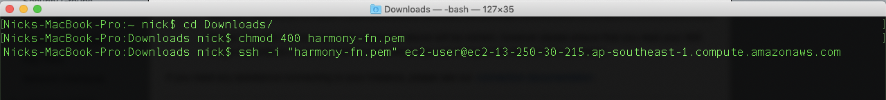

7. It may ask you whether or not you want to continue connecting. Type in “yes” and hit enter.

8. Congratulations! You should be logged into your new AWS instance! If you need further instructions, you can find more information here: https://harmony.one/nodes

9. Run the following command to make sure your instance is properly updated:
	```
	sudo yum update
	```

10. Make a new directory to store your Harmony keys with the following command:
	```
	mkdir -p ~/.hmy/keystore
	```

11. Now execute the following commands to download the wallet software and allow it to be executed.
	```
	curl -LO https://harmony.one/wallet.sh
	chmod u+x wallet.sh
	./wallet.sh -d
	```

12. Create a new key pair with the following command and input your passphrase:
	```
	./wallet.sh new
	```
  


13. Create a BLS key pair with the following command (private key hidden in image):
	```
	./wallet.sh blsgen
	```
  


14. Step 12 should create an account address starting with “one”. Send this account address to genesis@harmony.one, together with your discord handle with #number suffix, i.e.“@Eugene Kim | Harmony#9608”, also include your BLS public key from step 13. Please Use the subject line “mainnet v0 key”.
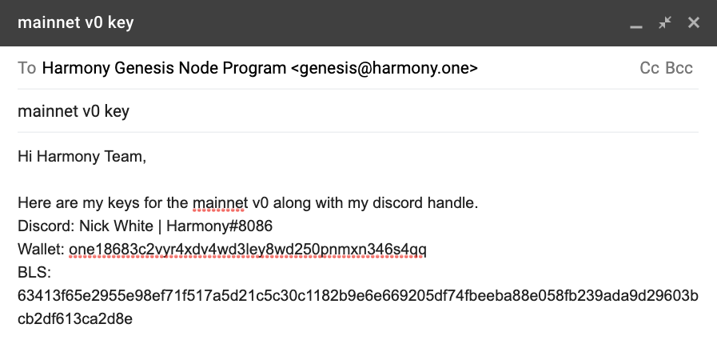

15. We will reply to your email with a 9 digit code. Simply reply to that email and copy that 9 digit code. This will ensure that your email address is legitimate and not spoofed.

16. Almost there! Now that we have your public key, we will include you as a validator in our genesis block. To verify if your account address is included in the genesis block check the following link. Be patient as this will take time before it is updated. https://raw.githubusercontent.com/harmony-one/harmony/master/internal/genesis/foundational.go.

**Connecting your node to Harmony network**

1. Once you’ve submitted your keys to the Harmony Team and they have been input into this file, wait for the network to be restarted and then you will be able to connect your node. Otherwise you will not have permission to participate since your address won’t be recognized.

2. If you have satisfied the above, then Install tmux using the following command:
	```
	sudo yum install -y tmux
	```
  


3. Create a virtual terminal session in tmux. This will hide all of your past entries to the command line.
	```
	tmux new-session -s node
	```
  
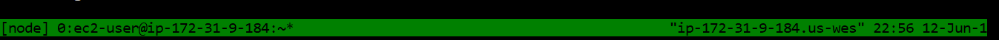

4. Fetch the node script from our Github:
	```
	curl -LO https://harmony.one/node.sh
	```

5. Change the permission of the script:
	```
	chmod u+x node.sh
	```

6. If your account account appears in the list, you will be able to join the testnet when it is launched. Stay in touch via the community channels and when the testnet is up and running, run the following command to connect your node, but replace “ACCOUNT_ADDRESS” with your actual “one” address:
	```
	sudo ./node.sh
	```
  

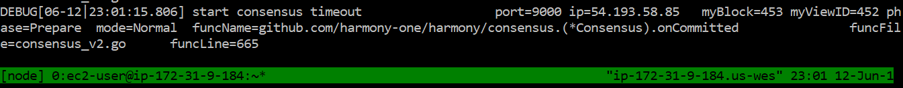

7. If you are joining after the network has been up for a while, it will take some time for you to sync to the latest block. Be patient and keep an eye out for a message that says “Node is now in sync!”

8. Next, exit tmux from the command line in order to check your balance:
		First hit “Ctrl+b”
			- Pressing Ctrl+b allows you to enter some of tmux’s commands. (Command+b for mac)
		Then hit "d"
			- d is the tmux command for detach, returning you to the terminal before starting tmux. Press d after releasing ctrl+b, not at the same time.
  
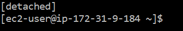

9. In the case you need to go back to the previous exited session, using the following command:
	```
	tmux attach
	```

10. Now we will check the functionality to ensure you are connected:
	``` grep BINGO latest/validator*.log
	```
	These take time to generate, repeat this command to see how times your node helped to reach consensus.
  
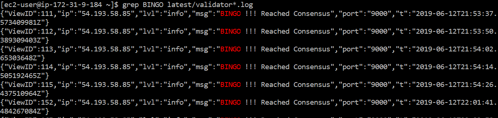

11. Now let’s check the balance of your account to make sure you are receiving block rewards. Enter the following command with your “one” address:
	```
	./wallet.sh balances --address ACCOUNT_ADDRESS
	```
  
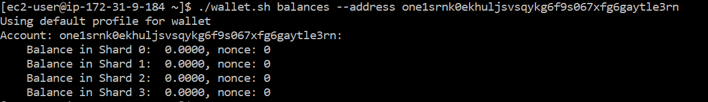

# Tips/FAQ/Troubleshooting
1. AWS EC2 is used in this example, though there are few limitations If you are more comfortable using a different cloud computing service which allows access to Linux 2, and the correct ports are open, with a sufficient amount of processing power, there are no set limitations in doing so. Some examples are Microsoft’s Azure, Google Cloud Platform, IBM Bluemix, and Alibaba Cloud should all function for the purposes of running a node.

2. For better security it’s recommended to always access AWS through IAM user accounts and to set up MFA (multi-factor authentication) on both root and IAM user accounts. https://docs.aws.amazon.com/IAM/latest/UserGuide/getting-started_create-admin-group.html

3. You can get circa 33% discount by purchasing a reserved instance with no upfront cost. If you have a new AWS account, it *might* require opening a support ticket to raise the limit for no upfront reserved instances. Also you might need to have at least one month of a successful billing history on AWS account to be able to purchase with no upfront.

4. If when your .pem key is generated it includes the extension .pem.txt, change the command given in the “Connect” example to match the file name exactly. Ex:
	```
	ssh -i "harmomy-fn.pem.txt" ec2-user@ec2-18-139-83-3.ap-southeast-1.compute.amazonaws.com
	```


5. Generation of BLS keys is independent of your harmony “one” address

6. If you are receiving an error message after attempting to launch the EC2 instance, it may be because your account is new. If this is the case, wait for a couple of minutes for Amazon to verify your account and try again. EX:

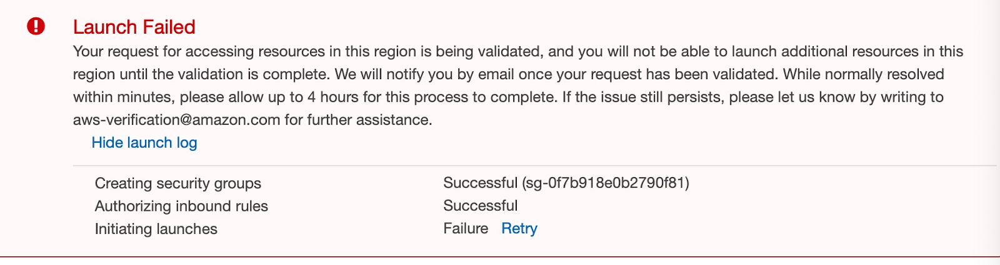

7. Can I run multiple nodes on the same VM (EC2 instance)?
Yes, you can create a new tmux using a different name than the one created in the example provided (node). From here you can start another node with a second address.

8. Does running another node on the same VM (EC2 instance) reduce my costs?
This is a question that we are currently answering. This question also brings into account an added risk of having all of your nodes running on a single point of failure.

9. The line 
	```
	curl -LO https://raw.githubusercontent.com/harmony-one/harmony/ceae22e5a088a20d964b329ad281dad289292843/scripts/node.sh
	```
	is giving me an error.

	Try running this line again after a couple of minutes and the issue should be fixed.

10. When I try to SSH into my EC2 instance, I am getting an error message:

	To solve this issue, make sure that you “cd “ into the folder holding your pem file, and type in the following command:

	```
	chmod 400 /Users/myself/Documents/MyAccessKey1.pem
	```
  
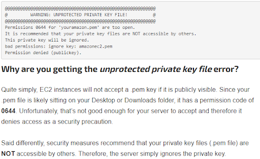
  Change the directory to be that of your saved .pem file. This changes the access to this file so it is more private and can be securely used as a key.

11. After running “sudo ./node.sh ACCOUNT_ADDRESS” if you are getting error message account ID not found, that means that your account ID hasn’t yet been synced with our system. After your Discord and Email accounts have been verified through our emailing process with genesis@harmony.one, you should be able to access your account using this line.


