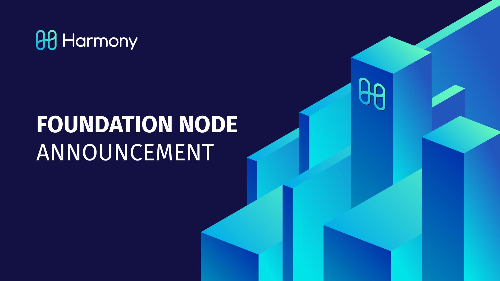

**Reporting and Monitoring Tools**

* Monitoring
  * [Harmony Explorer](https://explorer.harmony.one/)

* Status Overview
  * [status.harmony.one](https://status.harmony.one/)
  * [Harmony Shard Status - Blockchain Height](https://harmony.one/status)

* Rewards Overview
  * [Foundational Node Rewards](https://harmony.one/balances)
  * [Foundational Node Reward Rate - 1 hour](https://harmony.one/1h)
  * [Foundational Node Reward Rate - 4 hour](https://harmony.one/4h)
  * [Foundational Node Reward Rate - 1 day](https://harmony.one/day)
